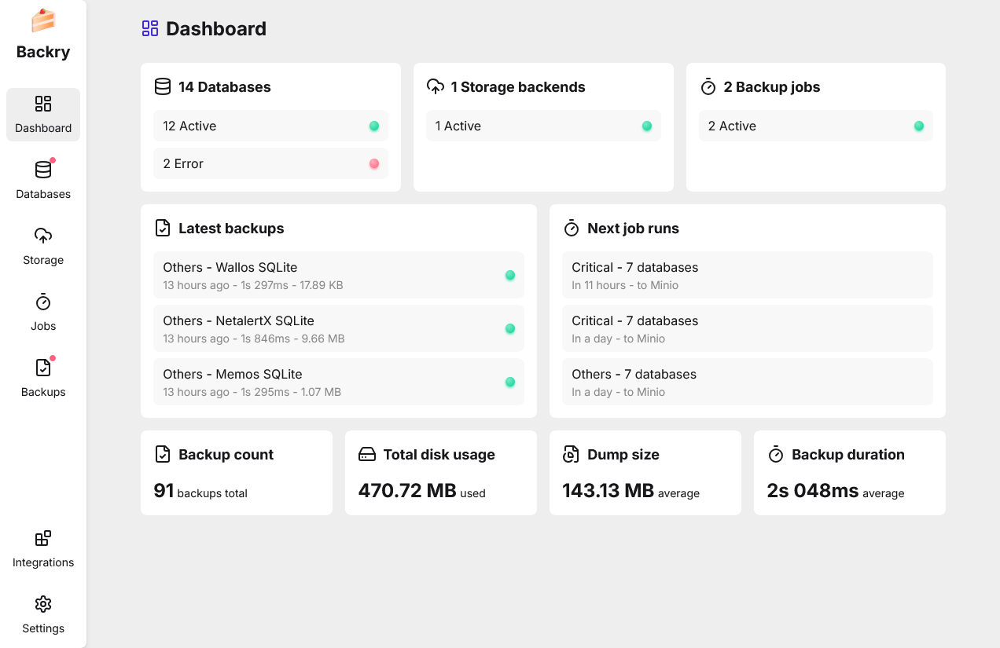

<p align="center">
  <h1 align="center">Backry</h1>
  <p align="center">
    
  </p>
  <p align="center">
    An easy-to-use, fast, and efficient database backup solution based on Restic.
  </p>
  <p align="center">
    
    
    
    
    
  </p>
</p>

## Features

- ⚡️ **Easy to use**: Designed to be user-friendly, with an intuitive web interface and simple configuration.
- ⏲️ **Scheduled backups**: Uses cron jobs to schedule backups.
- 💽 **Multiple database engines**: Supports SQLite, MySQL, PostgreSQL, and MongoDB, with more to come.
- 💾 **Multiple storage backends**: Supports various backends, including local file systems, S3-compatible
  services, FTP, and more.
- 📚 **Incremental backups**: Uses [Restic](https://github.com/restic/restic) to perform incremental backups, saving
  storage space and time.
- 🔐 **Safe**: Encrypts your backups using Restic's built-in encryption, ensuring your data is secure.
- 🐳 **Docker integration**: Add your Docker container databases to Backry with just a few clicks.
- 🔔 **Notifications**: Get notified about backup status via many channels, thanks
  to [Shoutrrr](https://github.com/nicholas-fedor/shoutrrr).
- ♻️ **Advanced pruning**: Automatically delete old backups to save storage space, with customizable retention policies.



*See more screenshots in the [screenshots](./screenshots) directory.*

## Installation

```yaml
services:
  backry:
    image: cefadrom/backry:latest
    restart: unless-stopped
    hostname: backry # Used by Restic
    ports:
      - "3000:3000"
    environment:
      - TZ=Europe/Paris # Set your timezone for cron jobs
    volumes:
      - /var/run/docker.sock:/var/run/docker.sock:ro # Required for Docker integration
      - db:/app/db
      - myservice-db:/mnt/myservice # Mount your SQLite databases
    networks:
      - my-db # Connect to your databases networks

volumes:
  db:

networks:
  my-db:
    external: true
```

## Supported database engines

- [x] SQLite
- [x] MySQL
- [x] PostgreSQL
- [x] MongoDB
- [ ] Redis (planned)
- [ ] MariaDB (planned)
- [ ] Microsoft SQL Server (planned)

## Configuration

Backry can be configured using environment variables. If you're using the provided Docker container, do **not** change
the database URL or the CLI tools commands.

### Backry

| Environment variable | Description                           | Default value                            |
|----------------------|---------------------------------------|------------------------------------------|
| `DATABASE_URL`       | Backry's SQLite database path         | `/app/db/backry.db` (**only in Docker**) |
| `TZ`                 | Timezone for cron jobs                | System / container timezone              |
| `BACKRY_LOG_LEVEL`   | [Pino](https://getpino.io/) log level | `info`                                   |
| `BACKRY_LOG_PRETTY`  | Pretty print logs in development      | `true` if `NODE_ENV !== "production"`    |

### System cron jobs

| Environment variable         | Description                                 | Default value                                          |
|------------------------------|---------------------------------------------|--------------------------------------------------------|
| `BACKRY_STORAGE_CHECK_CRON`  | Ping storage backends and fetch basic stats | `*/10 * * * *` (every 10 minutes)                      |
| `BACKRY_DATABASE_CHECK_CRON` | Ping databases                              | `*/10 * * * *` (every 10 minutes)                      |
| `BACKRY_STORAGE_HEALTH_CRON` | Advanced checks for storage backends health | `5,35 * * * *` (every 30 minutes, offset by 5 minutes) |
| `BACKRY_DB_MAINTENANCE_CRON` | Backry's database maintenance operations    | `30 4 * * *` (daily at 04:30)                          |

### CLI tools commands

| Environment variable       | Description               | Default value |
|----------------------------|---------------------------|---------------|
| `BACKRY_SQLITE_DUMP_CMD`   | Dump SQLite3 databases    | `sqlite3`     |
| `BACKRY_POSTGRES_DUMP_CMD` | Dump PostgreSQL databases | `pg_dump`     |
| `BACKRY_MYSQL_DUMP_CMD`    | Dump MySQL databases      | `mysqldump`   |
| `BACKRY_MYSQL_CHECK_CMD`   | Check MySQL connection    | `mysql`       |
| `BACKRY_MONGO_DUMP_CMD`    | Dump MongoDB databases    | `mongodump`   |
| `BACKRY_RESTIC_CMD`        | Restic command            | `restic`      |
| `BACKRY_SHOUTRR_CMD`       | Shoutrrr command          | `shoutrrr`    |

## Why Restic?

Using Restic as the "file system" for Backry is a bold choice, as it's not the tool's primary intended use.
However, Restic is battle-tested and has been around for a while, so problems *shouldn't* happen (though you should
regularly test your
backups anyway!). On the positive side, Restic is a very powerful tool that allows for encryption and deduplication,
which makes Backry a great solution (in my unbiased opinion). It also supports many storage backends, which is a big
plus. Implementing all these features by hand would have been long, tedious, and error-prone. The goal of Backry is not
to
provide a perfect backup solution, but rather a "far better than nothing" solution that is easy to use.

## Inspirations

This project is heavily inspired by [eduardolat/pgbackweb](https://github.com/eduardolat/pgbackweb), as both projects
aim to achieve the same thing. However, Backry improves on it by providing support for more database engines, more
storage backends, and
incremental backups.

It is also inspired by [tiredofit/docker-db-backup](https://github.com/tiredofit/docker-db-backup), which at one point
was my database backup solution for my homelab. The desire for a similar tool with a friendly web interface kickstarted
the idea for Backry.

Finally, Backry's interface takes some elements from [StarFleetCPTN/GoMFT](https://github.com/StarFleetCPTN/GoMFT)'s
design, even though GoMFT remains prettier (someday I'll do a graphic overhaul).

## About the icon

The backry icon is, for now, an emoji taken from the MIT licensed
[microsoft/fluentui-emoji](https://github.com/microsoft/fluentui-emoji/tree/main/assets/Shortcake)
icon set. Icon design is not my strong suit, so if anyone wants to contribute a better one, feel free to
do so!

## Was it vibecoded?

Nope, I only use GitHub Copilot's auto-complete feature (which is not that great with Svelte 5, btw).
If there are any bugs or issues, it's all on me :)

## Contributing

If you want to contribute to Backry, feel free to open an issue or a pull request. Any help is welcome!

To easily run the project, you can use the provided devcontainer. It automatically installs all dependencies and
binaries needed.

<a href="https://codespaces.new/julien-wff/backry/" target="_blank" rel="noopener noreferrer">
  
</a>
